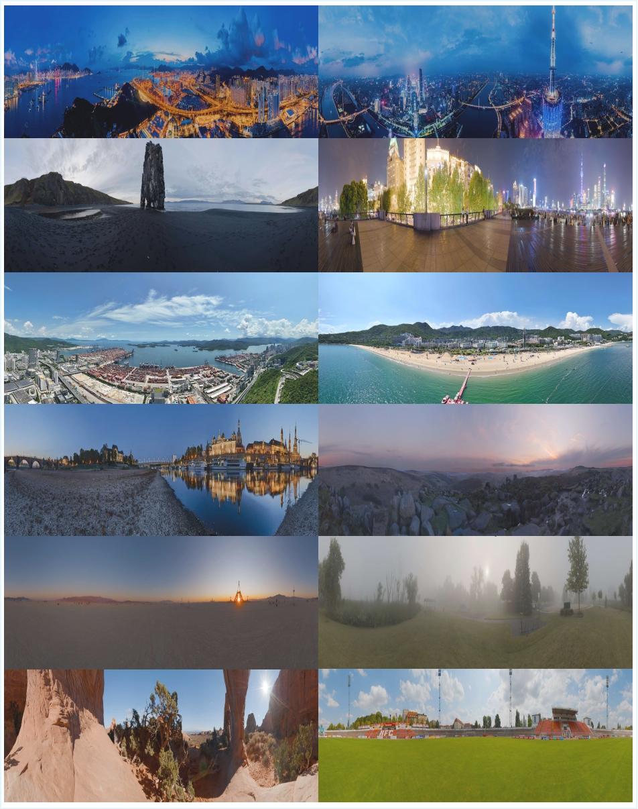

# Pano360: Perspective to Panoramic Vision with Geometric Consistency

**Pano360** is a large transformer network for panorama stitching, which supports input ranges from a few to hundreds of images and stitches them in seconds
It adopts **camera-pose to guide image warping in 3D photogrammetric space** and **multi-feature joint optimization strategy**-to compute the seam mask. Our method significantly outperforms prior methods in perceptual quality and alignment accuracy. 
