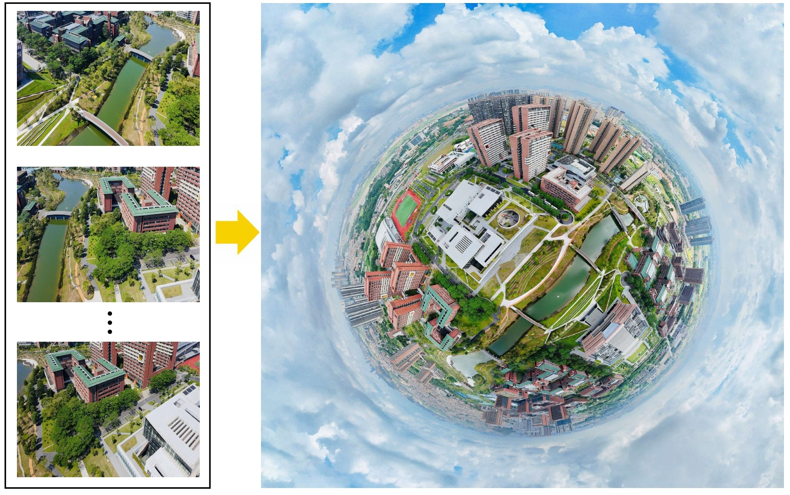

<div align="center">
<h1>Pano360: Perspective to Panoramic Vision with Geometric Consistency</h1>

<a href="https://arxiv.org/abs/2603.12013"></a>
[](https://huggingface.co/datasets/DongZhi/Pano360)


</div>




🚀 The [Pano360](https://huggingface.co/datasets/DongZhi/Pano360) dataset contains four scenes (a, b, c, d), including tourism, sports, and special lighting scenes.

### 📂 Dataset Directory Structure

```text
ROOT/
├── Scene(a)/                  # Tourism scenes
│   ├── 0/                     # 1st sub-scene
│   │   ├── 001/               # 1st focal length
│   │   │   ├── cameras.json   # Ground truth camera parameters
│   │   │   └── images/        # Contains exactly 24 image frames
│   │   ├── 002/               # 2nd focal length
│   │   └── 003/               # 3rd focal length
│   ├── 1/                     # 2nd sub-scene
│   ├── ...                    # (Intermediate sub-scenes)
│   └── 165/                   # 166th sub-scene (Indexed 0 to 165)
│
├── Scene(b)/                  # Sports scenes
│   └── ...                   
│
├── Scene(c)/                  # Special lighting scenes
│   └── ...                    
│
└── Scene(d)/                  # Unsupervised in-the-wild scenes
    └── ...                    
```

```bibtex
@inproceedings{zhu2026pano360,
  title={Pano360: Perspective to Panoramic Vision with Geometric Consistency},
  author={Zhu, Zhengdong and Xue, Weiyi and Yang, Zuyuan and Zhou, Wenlve and Zhou, Zhiheng},
  booktitle={Proceedings of the IEEE/CVF Conference on Computer Vision and Pattern Recognition},
  pages={7600--7609},
  year={2026}
}
```
